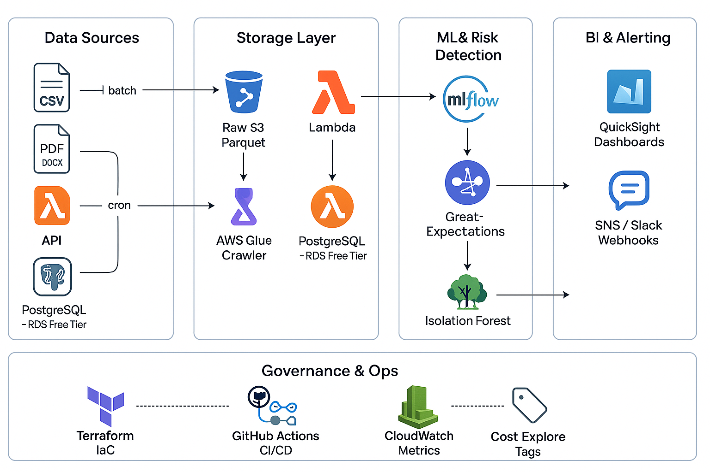

<!-- README.md -->

# End-to-End Data Quality & Compliance Automation Platform

A cloud-native platform that ingests heterogeneous documents, raises data-quality scores, and detects contractual compliance risks with NLP + ML.  
The repository contains infrastructure-as-code (Terraform), PySpark pipelines, ML workflows (MLflow / SageMaker), and CI/CD automation.

---

## 📐 High-Level Architecture



---

## 🎯 Key Objectives

- **Multi-format ingestion** at scale (CSV, XLSX, PDF, DOCX).
- **Data-quality uplift** ≥ 85 % within the first month.
- **Clause-level compliance-risk detection** using Gradient-Boost & Isolation Forest.
- **Cost-aware hybrid cloud**: free-tier RDS, spot EMR, student AWS credits.
- **Research contribution**: empirical comparison of TF-IDF vs. Transformer embeddings for legal-risk scoring.

---

## 🗂 Repository Structure

```
.
├── README.md
├── .gitignore
├── requirements.txt
├── docker/
│   └── dev.Dockerfile
├── infrastructure/
│   └── terraform/
│       ├── s3_landing_zone.tf
│       └── variables.tf
├── data/
│   └── raw/
│       └── sample_address_book.csv
└── src/
    ├── ingestion/
    │   └── ingest_csv.py
    ├── processing/
    ├── dq/
    ├── nlp/
    └── ml/
```

---

## 🚀 Quick Start

```bash
# Clone and enter the project
git clone https://github.com/<org>/dq-compliance-platform.git
cd dq-compliance-platform

# Build the local dev container
docker build -f docker/dev.Dockerfile -t dq-dev .

# Run container with AWS credentials
docker run --rm -it \
  -v ${PWD}:/workspace \
  -v ~/.aws:/root/.aws \
  -e DQ_BUCKET=<landing-zone-bucket> \
  dq-dev bash

# Upload sample data to S3
./infrastructure/scripts/upload_sample_data.sh
```

> **Prerequisites**
>
> - AWS CLI configured with an account that has S3 + Glue + Textract permissions
> - Terraform ≥ 1.6 for infrastructure deployment

---

## 🛠 Technology Stack

| Layer                    | Tooling (primary)                               |
| ------------------------ | ----------------------------------------------- |
| **Code / Orchestration** | Python 3.10 · PySpark 3.5 · Docker · Terraform  |
| **Data-Quality**         | Great Expectations                              |
| **NLP**                  | Spark NLP                                       |
| **Machine Learning**     | MLflow · SageMaker Processing                   |
| **Storage**              | S3 (raw + curated) · PostgreSQL (RDS free tier) |
| **BI & Alerting**        | Amazon QuickSight · Amazon SNS / Slack          |
| **CI/CD & Ops**          | GitHub Actions · CloudWatch · Cost Explorer     |

---

## 🧪 Test & Validation

- **Unit tests**: PyTest, target 60–70 % coverage.
- **Data-quality assertions**: Great Expectations checkpoints in CI.
- **Model validation**: K-fold CV, SHAP explainability.
- **End-to-End UAT**: ingestion → dashboard refresh ≤ 30 min.

---

## 🗺 Roadmap (excerpt)

| Phase                      | Timeline | Status         |
| -------------------------- | -------- | -------------- |
| 0 – Design docs            | Week 1   | ✅ Done        |
| 1 – Landing-zone S3 + Glue | Wks 2-3  | 🔄 In progress |
| 2 – Textract & Spark NLP   | Wks 4-5  | ⏳ Planned     |
| 3 – Data-Quality Framework | Wks 6-7  | ⏳ Planned     |
| 4 – ML Model Dev           | Wks 8-10 | ⏳ Planned     |

Full details in `docs/implementation_guide.md`.

---

## 🏷 Cost-Control Guidelines

1. **Local-first dev**: run PySpark in Docker; push to Glue only for integration tests.
2. **Spot & Stop**: EMR clusters on spot instances, `--auto-terminate` after job finish.
3. **Free-tier analytics**: RDS micro, QuickSight Standard (< £15/mo).
4. **Continuous tagging**: every Terraform resource carries `Project = <ID>` for Cost Explorer.

---

## 🤝 Contributing

Pull requests are welcome. Please fork the repo and create a feature branch prefixed with `feat/` or `fix/`.
All contributions must pass **ruff** linting and the PyTest suite in the GitHub Actions pipeline.

---

## 📜 Licence

This project is released under the MIT License. See `LICENSE` for details.
